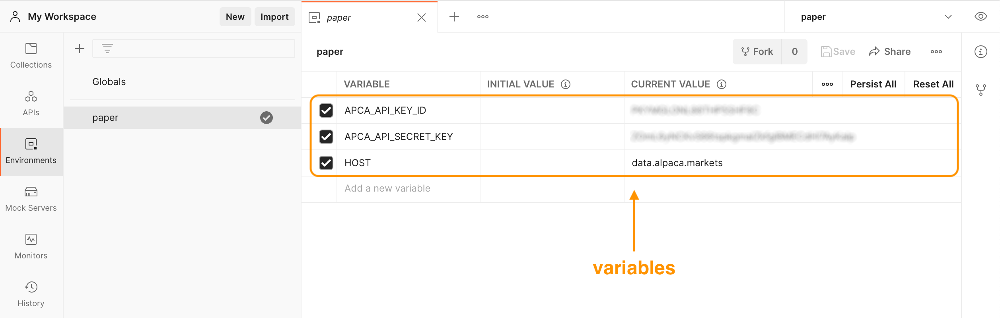
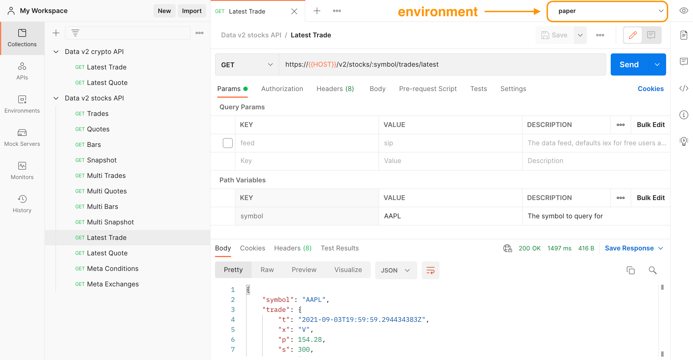

# Market Data

## Overview

Alpaca Data API v2 provides market data through an easy to use HTTP API for historical data and through websocket for real-time data.

We provide easy to use SDKs written in [Python](https://github.com/alpacahq/alpaca-trade-api-python), [Go](https://github.com/alpacahq/alpaca-trade-api-go), [NodeJS](https://github.com/alpacahq/alpaca-trade-api-js) and [C#](https://github.com/alpacahq/alpaca-trade-api-csharp).

Developers can easily access our Market Data APIs via [Postman collections](#postman-collections).

## Subscription Plans

Alpaca Data API v2 provides market data in 2 two different plans: **Free** and **Unlimited**.

The Free plan is included in both paper-only and live trading accounts as the default plan for free.

|                           | Free             | Unlimited              |
| ------------------------- | ---------------- | ---------------------- |
| Pricing                   | Free             | $9/mo                  |
| Securities coverage       | US Stocks & ETFs | US Stocks & ETFs       |
| Real-time market coverage | IEX              | All US Stock Exchanges |
| Websocket subscriptions   | 30 symbols       | Unlimited              |
| Historical data timeframe | 5+ years         | 5+ years               |
| Historical data delay     | 15 minutes       | -                      |
| Historical API calls      | 200/min          | Unlimited              |

The **Free plan** consists of data from IEX (Investors Exchange LLC).

For the **Unlimited plan**, we receive direct feeds from the CTA (administered by NYSE) and UTP (administered by Nasdaq) SIPs. These 2 feeds combined offer 100% market volume. 

## Exchanges

List of stock exchanges which are supported by Alpaca.

The tape id of each exchange is returned in all market data requests. You can use this table to map the code to an exchange.

| Exchange Code | Name of Exchange                  |
| ------------- | --------------------------------- |
| A             | NYSE American (AMEX)              |
| B             | NASDAQ OMX BX                     |
| C             | National Stock Exchange           |
| D             | FINRA ADF                         |
| E             | Market Independent                |
| H             | MIAX                              |
| I             | International Securities Exchange |
| J             | Cboe EDGA                         |
| K             | Cboe EDGX                         |
| L             | Long Term Stock Exchange          |
| M             | Chicago Stock Exchange            |
| N             | New York Stock Exchange           |
| P             | NYSE Arca                         |
| Q             | NASDAQ OMX                        |
| S             | NASDAQ Small Cap                  |
| T             | NASDAQ Int                        |
| U             | Members Exchange                  |
| V             | IEX                               |
| W             | CBOE                              |
| X             | NASDAQ OMX PSX                    |
| Y             | Cboe BYX                          |
| Z             | Cboe BZX                          |

## Conditions

Each feed/exchange uses its own set of codes to identify trade and quote conditions, so the same condition may have a different code depending on the originator of the data. 

### Trade conditions

### CTS

The table below shows codes that denotes a particular condition applicable to the trade from the CTA Plan. 

For more information, see page 64 of the [Consolidated Tape System (CTS) Specification](https://www.ctaplan.com/publicdocs/ctaplan/CTS_Pillar_Output_Specification.pdf).

| Code  | Value                                            | Code | Value                                                    |
| ----- | ------------------------------------------------ | ---- | -------------------------------------------------------- |
| Space | Regular Sale                                     | Q    | Market Center Official Open                              |
| B     | Average Price Trade                              | R    | Seller                                                   |
| C     | Cash Trade (Same Day Clearing)                   | T    | Extended Hours Trade                                     |
| E     | Automatic Execution                              | U    | Extended Hours Sold (Out Of Sequence)                    |
| F     | Inter-market Sweep Order                         | V    | Contingent Trade                                         |
| H     | Price Variation Trade                            | X    | Cross Trade                                              |
| I     | Odd Lot Trade                                    | Z    | Sold (Out Of Sequence)                                   |
| K     | Rule 127 (NYSE only) or Rule 155 (NYSE MKT only) | 4    | Derivatively Priced                                      |
| L     | Sold Last (Late Reporting)                       | 5    | Market Center Reopening Trade                            |
| M     | Market Center Official Close                     | 6    | Market Center Closing Trade                              |
| N     | Next Day Trade (Next Day Clearing)               | 7    | Qualified Contingent Trade                               |
| O     | Market Center Opening Trade                      | 8    | Reserved                                                 |
| P     | Prior Reference Price                            | 9    | Corrected Consolidated Close Price as per Listing Market |

### UTDF

The table below shows condition codes from the UTP Plan. 

For more information, see page 43 of the [UTP Specification](https://www.utpplan.com/DOC/UtpBinaryOutputSpec.pdf#page=43).

| Code | Value                        | Code | Value                                             |
| ---- | ---------------------------- | ---- | ------------------------------------------------- |
| @    | Regular Sale                 | R    | Seller                                            |
| A    | Acquisition                  | S    | Split Trade                                       |
| B    | Bunched Trade                | T    | Form T                                            |
| C    | Cash Sale                    | U    | Extended trading hours (Sold Out of Sequence)     |
| D    | Distribution                 | V    | Contingent Trade                                  |
| E    | Placeholder                  | W    | Average Price Trade                               |
| F    | Intermarket Sweep            | X    | Cross Trade                                       |
| G    | Bunched Sold Trade           | Y    | Yellow Flag Regular Trade                         |
| H    | Price Variation Trade        | Z    | Sold (out of sequence)                            |
| I    | Odd Lot Trade                | 1    | Stopped Stock (Regular Trade)                     |
| K    | Rule 155 Trade (AMEX)        | 4    | Derivatively priced                               |
| L    | Sold Last                    | 5    | Re-Opening Prints                                 |
| M    | Market Center Official Close | 6    | Closing Prints                                    |
| N    | Next Day                     | 7    | Qualified Contingent Trade (QCT)                  |
| O    | Opening Prints               | 8    | Placeholder For 611 Exempt                        |
| P    | Prior Reference Price        | 9    | Corrected Consolidated Close (per listing market) |
| Q    | Market Center Official Open  |      |                                                   |

## Quote conditions

### CQS

The table below shows codes that denotes a particular condition applicable to a quote from the CTA Plan. 

For more information, see Appendix G of the [CQS Specification](https://www.ctaplan.com/publicdocs/ctaplan/CQS_Pillar_Output_Specification.pdf).

| Code | Value                         |
| ---- | ----------------------------- |
| A    | Slow Quote Offer Side         |
| B    | Slow Quote Bid Side           |
| E    | Slow Quote LRP Bid Side       |
| F    | Slow Quote LRP Offer Side     |
| H    | Slow Quote Bid And Offer Side |
| O    | Opening Quote                 |
| R    | Regular Market Maker Open     |
| W    | Slow Quote Set Slow List      |
| C    | Closing Quote                 |
| L    | Market Maker Quotes Closed    |
| U    | Slow Quote LRP Bid And Offer  |
| N    | Non Firm Quote                |
| 4    | On Demand Intra Day Auction   |

### UQDF

The table below shows condition codes from the UTP Plan.

For more information, see the [UQDF Specification](http://www.utpplan.com/DOC/uqdfspecification.pdf).

| Code | Value                          |
| ---- | ------------------------------ |
| A    | Manual Ask Automated Bid       |
| B    | Manual Bid Automated Ask       |
| F    | Fast Trading                   |
| H    | Manual Bid And Ask             |
| I    | Order Imbalance                |
| L    | Closed Quote                   |
| N    | Non Firm Quote                 |
| O    | Opening Quote Automated        |
| R    | Regular Two Sided Open         |
| U    | Manual Bid And Ask Non Firm    |
| Y    | No Offer No Bid One Sided Open |
| X    | Order Influx                   |
| Z    | No Open No Resume              |
| 4    | On Demand Intra Day Auction    |

## Postman collections

We provide Postman collections to help our developers to easily access and test our REST APIs.

### Available collections
 
* [Data v2 stocks API](./postman/data_v2_stocks_api.postman_collection.json)
* [Data v2 crypto API](./postman/data_v2_crypto_api.postman_collection.json)

### Usage

1. Create a Postman environment (File -> New...) with the following variables


 



2. Download one of the collections from the "Available collections" links
3. Import the file into Postman (File -> Import...)
4. Use one of the defined HTTP requests while the created environment is selected


 



Please visit our [Support](https://alpaca.markets/support/) page to learn more about our market data products.

